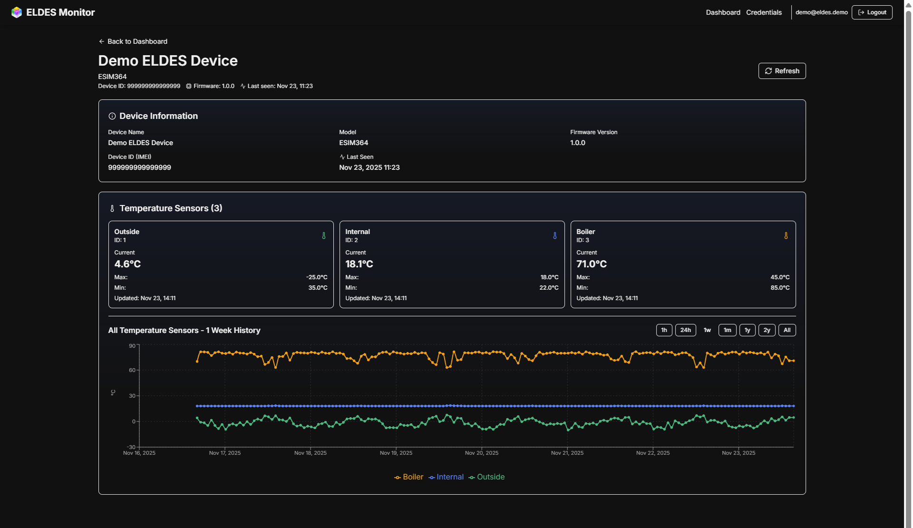

# ELDES ESIM364 Monitor

A modern Next.js application for monitoring and controlling ELDES ESIM364 alarm systems via the ELDES Cloud API.

## 📋 About

This project is a fork and enhancement of existing ELDES monitoring solutions, combining the best features from the community to provide a comprehensive monitoring and control interface for ELDES ESIM364 alarm systems.

## 🙏 Acknowledgments

This project is inspired by and builds upon the excellent work of:

- **[augustas2/eldes](https://github.com/augustas2/eldes)** - Original ELDES monitoring implementation
- **[tanelvakker/eldes-cloud-api](https://github.com/tanelvakker/eldes-cloud-api)** - ELDES Cloud API client library

We extend our sincere thanks to the original authors for their contributions to the ELDES ecosystem. This project would not have been possible without their pioneering work.

## 📄 License

This project is licensed under the MIT License - see the [LICENSE](LICENSE) file for details.

## Features

- **Device Monitoring**: Real-time status monitoring for all ESIM364 devices
- **Temperature Tracking**: Historical temperature data with charts
- **Zone Management**: View and monitor zone statuses
- **Remote Control**: Arm/disarm partitions remotely
- **Secure Credentials**: Encrypted storage of ELDES Cloud API credentials
- **Automated Fetching**: Hourly automatic device status updates
- **Mobile-First Design**: Responsive UI optimized for all devices

## Screenshots

### Temperature Monitoring Graph



The temperature monitoring graph displays historical temperature data with multiple time period views (1h, 24h, 1w, 1m, 1y, 2y, All) and supports multiple temperature sensors per device. The screenshot above shows the 1-week view of temperature data for the demo device.

## Quick Start

1. **Install Dependencies**
   ```bash
   npm install
   ```

2. **Set Encryption Key (Optional but Recommended)**
   ```bash
   # Generate a secure key
   openssl rand -base64 32
   # Add to .env.local or export as environment variable
   export ELDES_ENCRYPTION_KEY="your-generated-key-here"
   ```

3. **Build the Application**
   ```bash
   export PATH="/opt/bitnami/node/bin:$PATH"  # Ensure Node.js v22+ is in PATH
   npm run build
   ```

4. **Start the Application**
   ```bash
   chmod +x eldes-monitor.sh
   ./eldes-monitor.sh start    # Start with PM2 (production)
   # Or run directly without PM2 (for testing):
   ./eldes-monitor.sh run
   ```

5. **Access the Application**
   - Open your application URL (e.g., `https://yourdomain.com/eldes`)
   - Add your ELDES Cloud API credentials
   - Start monitoring your devices!

## Demo Data

For testing and demonstration purposes, demo data has been pre-loaded in the database:

- **Demo Device:**
  - Device ID: `999999999999999`
  - Device Name: `Demo ELDES Device`
  - Pre-generated temperature data: 30 days of hourly readings from 3 temperature sensors

**Note:** The demo device includes pre-generated temperature data for visualization and testing. To view the demo device, you need to be logged in with valid ELDES Cloud API credentials. The demo device will appear in your device list once you're logged in.

To regenerate or add demo data, run:
```bash
node scripts/add-demo-data.js
```

This script will:
- Create a demo ELDES credential entry (username: `demo@eldes.demo`, password: `demo`)
- Create a demo device with ID `999999999999999`
- Generate 30 days of realistic temperature data (3 sensors, hourly readings)

## Setup

### 1. Install Dependencies

```bash
cd /home/bitnami/eldes
npm install
```

### 2. Build the Application

**Important**: This project requires Node.js v22 or higher. The build process must use the correct Node.js version to prevent native module compilation errors.

#### Option A: Using the Correct PATH (Recommended)

Ensure the correct Node.js version is in your PATH before building:

```bash
export PATH="/opt/bitnami/node/bin:$PATH"
cd /home/bitnami/eldes
npm run build
```

#### Option B: Using the Management Script

The `eldes-monitor.sh` script automatically sets the correct PATH and provides process management:

```bash
chmod +x eldes-monitor.sh
export PATH="/opt/bitnami/node/bin:$PATH"
npm run build
```

#### Build Process Details

The build process will:
1. Compile TypeScript to JavaScript
2. Bundle Next.js application
3. Rebuild `better-sqlite3` native module (via `postinstall` script)
4. Optimize assets for production

**Note**: If you encounter `ERR_DLOPEN_FAILED` or `NODE_MODULE_VERSION` errors, ensure you're using Node.js v22+ and rebuild:

```bash
export PATH="/opt/bitnami/node/bin:$PATH"
npm rebuild better-sqlite3
npm run build
```

### 3. Set Environment Variables

Create a `.env.local` file (optional, defaults are used if not set):

```bash
ELDES_ENCRYPTION_KEY=your-secure-encryption-key-here
```

### 4. Start the Application

The application runs on port 3600 by default. You must use the correct Node.js version to prevent native module errors.

#### Option A: Using PM2 (Recommended for Production)

PM2 provides process management, auto-restart, and log management:

```bash
# Install PM2 globally (if not already installed)
npm install -g pm2

# Use the management script
chmod +x eldes-monitor.sh
./eldes-monitor.sh start

# Other management commands:
./eldes-monitor.sh stop      # Stop the application
./eldes-monitor.sh restart   # Restart the application
./eldes-monitor.sh reload    # Zero-downtime reload
./eldes-monitor.sh status    # Show application status
./eldes-monitor.sh logs      # View application logs
./eldes-monitor.sh run       # Run directly without PM2 (for testing)
```

**⚠️ Important**: The script will warn you if PM2 startup is not configured. To enable auto-start on system reboot:

```bash
pm2 startup
# Follow the instructions to run the generated command
pm2 save
```

#### Option B: Using the Management Script (Recommended)

The `eldes-monitor.sh` script provides process management and automatically sets the correct PATH:

```bash
chmod +x eldes-monitor.sh
./eldes-monitor.sh start    # Start with PM2 (production)
# Or for direct run without PM2:
./eldes-monitor.sh run      # Run directly (testing)
```

#### Option C: Manual Start with PATH

Set the PATH environment variable before starting:

```bash
export PATH="/opt/bitnami/node/bin:$PATH"
cd /home/bitnami/eldes
npm start
```

**Important**: Always ensure `/opt/bitnami/node/bin` is in your PATH before running `npm start` or `npm run build` to prevent `better-sqlite3` native module errors.

### 5. Apache Configuration

The Apache configuration has been updated to proxy `/eldes` to the Next.js application running on port 3600.

To apply the Apache configuration changes:

```bash
sudo /opt/bitnami/apache/bin/httpd -t  # Test configuration
sudo /opt/bitnami/ctlscript.sh restart apache  # Restart Apache
```

## Usage

1. **Add Credentials**: Navigate to `/eldes/credentials` and add your ELDES Cloud API credentials
2. **View Devices**: The dashboard automatically fetches and displays all devices
3. **Monitor Status**: Click on any device to view detailed status, temperature history, and zones
4. **Control Devices**: Use the arm/disarm buttons to control partitions remotely

## API Endpoints

- `GET /eldes/api/credentials` - List all credentials
- `POST /eldes/api/credentials` - Add new credentials
- `DELETE /eldes/api/credentials?id={id}` - Delete credentials
- `GET /eldes/api/devices` - List all devices (add `?refresh=true` to force refresh)
- `GET /eldes/api/devices/[deviceId]` - Get device details
- `POST /eldes/api/devices/[deviceId]/control` - Control device (arm/disarm)
- `POST /eldes/api/cron/start` - Start hourly cron job

## Database

The application uses SQLite (`eldes.db`) to store:
- User credentials (encrypted)
- Device information
- Device status history
- Temperature history

## Security

- Passwords are encrypted using AES-256-GCM
- Credentials are stored securely in the database
- All API endpoints are protected

## Development

### Prerequisites

- Node.js v22.0.0 or higher (required for `better-sqlite3` native module)
- Ensure `/opt/bitnami/node/bin` is in your PATH
- PM2 (optional, for production process management): `npm install -g pm2`

### Development Commands

```bash
# Start development server (port 3600)
npm run dev

# Build for production
npm run build

# Start production server (port 3600)
npm start

# Or use the management script (recommended for production)
./eldes-monitor.sh start    # Start with PM2
# Or run directly without PM2 (for testing):
./eldes-monitor.sh run
```

### Production Management with PM2

For production deployments, use PM2 for process management:

```bash
# Start application
./eldes-monitor.sh start

# Stop application
./eldes-monitor.sh stop

# Restart application
./eldes-monitor.sh restart

# Zero-downtime reload (graceful restart)
./eldes-monitor.sh reload

# View status
./eldes-monitor.sh status

# View logs
./eldes-monitor.sh logs

# Run directly without PM2 (for testing)
./eldes-monitor.sh run

# Configure auto-start on system reboot
pm2 startup
# (Follow instructions to run the generated command)
pm2 save
```

**Note**: The management script will warn you if PM2 startup configuration is missing and prompt before continuing.

### Running as a Systemd Service (Alternative)

You can also run the application as a systemd service instead of PM2:

Create `/etc/systemd/system/eldes-monitor.service`:

```ini
[Unit]
Description=ELDES ESIM364 Monitor
After=network.target

[Service]
Type=simple
User=bitnami
WorkingDirectory=/home/bitnami/eldes
Environment="ELDES_ENCRYPTION_KEY=your-key-here"
Environment="PATH=/opt/bitnami/node/bin:/usr/local/bin:/usr/bin:/bin"
ExecStart=/opt/bitnami/node/bin/npm start
Restart=always

[Install]
WantedBy=multi-user.target
```

Then:
```bash
sudo systemctl enable eldes-monitor
sudo systemctl start eldes-monitor
sudo systemctl status eldes-monitor
```

### Troubleshooting Build/Start Errors

#### Error: `ERR_DLOPEN_FAILED` or `NODE_MODULE_VERSION mismatch`

This occurs when `better-sqlite3` was compiled with a different Node.js version. Fix:

```bash
# 1. Ensure correct Node.js version is in PATH
export PATH="/opt/bitnami/node/bin:$PATH"

# 2. Verify Node.js version (should be v22+)
node --version

# 3. Rebuild the native module
npm rebuild better-sqlite3

# 4. Rebuild the application
npm run build
```

#### Error: `EADDRINUSE: address already in use :::3600`

Port 3600 is already in use. Find and kill the process:

```bash
# Find the process
lsof -i :3600
# Or
ss -tlnp | grep 3600

# Kill the process (replace PID with actual process ID)
kill -9 <PID>
# Or kill all node processes
pkill -f "next"
```

### Apache Configuration Issues

If you're using Apache as a reverse proxy:

- Check Apache error logs: `/opt/bitnami/apache/logs/error_log`
- Verify proxy modules are loaded: `sudo /opt/bitnami/apache/bin/httpd -M | grep proxy`
- Test Apache configuration: `sudo /opt/bitnami/apache/bin/httpd -t`
- Restart Apache: `sudo /opt/bitnami/ctlscript.sh restart apache`

### Database Issues

- The database is automatically created on first run
- Location: `eldes.db` (in the project root)
- To reset: Delete `eldes.db` and restart the application
- Verify database file permissions: `ls -la eldes.db`
- The database stores:
  - User credentials (encrypted)
  - Device information
  - Device status history
  - Temperature history (24+ hours)

## Notes

- The hourly cron job automatically fetches device statuses
- Manual refresh is available via the refresh button
- The application is configured with `basePath: "/eldes"` for subdirectory deployment


## Contributing

Contributions are welcome! Please see [CONTRIBUTING.md](CONTRIBUTING.md) for guidelines.

## License

This project is licensed under the MIT License - see the [LICENSE](LICENSE) file for details.

## Related Projects

This project is inspired by and builds upon the excellent work of:

- **[augustas2/eldes](https://github.com/augustas2/eldes)** - Original ELDES monitoring implementation
- **[tanelvakker/eldes-cloud-api](https://github.com/tanelvakker/eldes-cloud-api)** - ELDES Cloud API client library (Python)

We extend our sincere thanks to the original authors for their contributions to the ELDES ecosystem.
